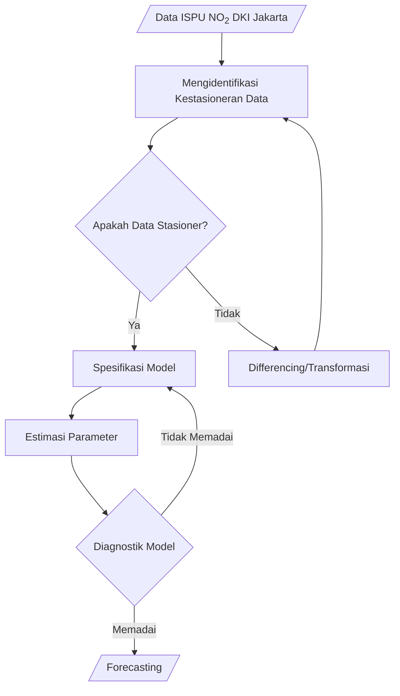

# Time Series Analysis


> **Disclaimer :**
> 
> This project is for educational purposes.
> 
> **Tujuan :**
> 
> 1. Mengetahui proses dalam menganalisis data runtun waktu sampai mendapatkan model yang sesuai pada data tersebut.
> 2. Mendapatkan model runtun waktu yang terbaik dalam efisiensi parameter maupun kemampuan prediktif dalam memprediksi ISPU NO<sub>2</sub> di DKI Jakarta berdasarkan data 1 Juni 2021 sampai 27 Oktober 2021.
> 3. Mendapatkan hasil prediksi ISPU NO<sub>2</sub> di DKI Jakarta dalam rentang 4 hari sesudah 27 Oktober 2021.
>
> **Credits :**
> 
> 1. Raden Fadil Aji Saputra
> 2. Fria Nurul Hidayat
> 3. Martin Nathaniel


## 1. Data ##
Sampel yang digunakan dalam penelitian ini adalah [data ISPU NO<sub>2</sub> di provinsi DKI Jakarta](https://data.jakarta.go.id/dataset/indeks-standar-pencemaran-udara-ispu-tahun-2021) harian selama 149 hari, sejak 1 Juni hingga 27 Oktober 2021.
<p align="center">
  
  <i>Gambar 1 Plot Data Indeks Standar Pencemaran Udara NO<sub>2</sub></i>
</p>

Berikut ringkasan dari data yang digunakan:
```
     Waktu                Index      
 Min.   :2021-06-01   Min.   :14.00  
 1st Qu.:2021-07-08   1st Qu.:26.00  
 Median :2021-08-14   Median :31.00  
 Mean   :2021-08-14   Mean   :31.88  
 3rd Qu.:2021-09-20   3rd Qu.:36.00  
 Max.   :2021-10-27   Max.   :63.00  
```

## 2. Tahapan Penelitian ##


## 3. Uji Stasioner ##
Berdasarkan **Gambar 1** dapat dilihat bahwa secara subjektif data ISPU NO<sub>2</sub> yang dimiliki belum bersifat stasioner karena dapat dilihat masih terdapat kecenderungan naik atau turun.
```
	Augmented Dickey-Fuller Test

data:  index
Dickey-Fuller = -3.035, Lag order = 5, p-value = 0.1452
alternative hypothesis: stationary
```

Berdasarkan Uji Augmented Dickey-Fuller, didapatkan $p − value = 0.1452 > 0.05$. Keputusan yang diambil adalah tidak menolak $H_0$ dan disimpulkan bahwa data observasi bersifat tidak stasioner, sehingga perlu dilakukan transformasi pada data dengan melakukan differencing terhadap data.
<p align="center">
  
  <i>Gambar 2 Plot Data Indeks Standar Pencemaran Udara NO<sub>2</sub> Setelah Differencing (d = 1)</i>
</p>

```
	Augmented Dickey-Fuller Test

data:  diff_index
Dickey-Fuller = -8.6387, Lag order = 5, p-value = 0.01
alternative hypothesis: stationary

Warning message:
In adf.test(diff_index) : p-value smaller than printed p-value
```

Berdasarkan **Gambar 2** secara subjektif data sudah terlihat stasioner. Berdasarkan Uji Augmented Dickey-Fuller didapatkan $p − value = 0.01 < 0.05$. Keputusan yang diambil adalah menolak $H_0$ dan disimpulkan bahwa data observasi hasil differencing bersifat stasioner.

## 4. Spesifikasi Model ##
Pemilihan model akan dilakukan berdasarkan grafik ACF, PACF, dan EACF dari data hasil differencing.
### 4.1. ACF dan PACF ###
<p align="center">
  
  <i>Gambar 3 Plot ACF dan PACF Data Indeks Standar Pencemaran Udara NO<sub>2</sub> Setelah Differencing (d = 1)</i>
</p>

Berdasarkan **Gambar 3**, pada plot ACF dapat dilihat terdapat tiang pancang pada lag ke−1. Sementara itu, pada plot PACF terdapat tiang pancang hingga lag ke−4. Pola yang didapat dari plot ACF dan PACF tidak menggambarkan pola AR atau MA. Maka, model runtun waktu yang diduga adalah ARIMA yang ordenya akan dicari melalui tabel EACF.

### 4.2. EACF ###
```
AR/MA
   0 1 2 3 4 5 6 7 8 9 10 11 12 13 14 15
0  x o o o o o o o o o o  o  o  o  o  o 
1  x o o o o o o o o o o  o  o  o  o  o 
2  x x o o o o o o o o o  o  o  o  o  o 
3  x o x o o o o o o o o  o  o  o  o  o 
4  x x x x o o o o o o o  o  o  o  o  o 
5  x x x x o x o o x o o  o  o  o  o  o 
6  x x x x o x o o x o o  o  o  o  o  o 
7  x x x x o x x o o o o  o  o  o  o  o 
8  x x x x o o o o o o o  o  o  o  o  o 
9  o o x o o o o o o o o  o  o  o  o  o 
10 x o x o o o o o o o o  o  o  o  o  o 
11 x x o o o o o o o o o  o  o  o  o  o 
12 x x x o o o o o o o o  o  o  o  o  o 
13 x x x o o o o o o o o  o  o  o  o  o 
14 x o o o o o o o o o o  x  o  o  o  o 
15 x x o o o o o o o o o  x  o  o  o  o
```

Berdasarkan tabel EACF. terdapat tiga model yang akan menjadi kandidat, yaitu $ARIMA(0,1,1)$, $ARIMA(1,1,1)$, dan $ARIMA(2,1,2)$. Dari ketiga model tersebut akan diseleksi untuk memperoleh model terbaik.

## 5. Pemilihan Model Terbaik ##
Pemilihan model terbaik akan didasari atas nilai Log-Likelihood terbesar, nilai Akaike Information Criterion (AIC) terkecil dan Bayesian Information Criterion (BIC) terkecil. Metode pemilihan dilakukan dengan cara pertama membuat semua model ARIMA yang menjadi kandidat model terbaik, kemudian membandingkan nilai Log- Likelihood, AIC, dan BIC.
```
          model1      model2      model3     
coef      numeric,2   numeric,3   numeric,5  
sigma2    64.26305    62.99618    62.2411    
var.coef  numeric,4   numeric,9   numeric,25 
mask      logical,2   logical,3   logical,5  
loglik    -517.4861   -515.5649   -514.3892  
aic       1040.972    1039.13     1040.778   
arma      integer,7   integer,7   integer,7  
residuals ts,149      ts,149      ts,149     
call      expression  expression  expression 
series    "df$Index"  "df$Index"  "df$Index" 
code      0           0           0          
n.cond    0           0           0          
nobs      148         148         148        
model     list,10     list,10     list,10    
aicc      1041.139    1039.41     1041.374   
bic       1049.964    1051.119    1058.762   
xreg      integer,149 integer,149 integer,149
x         numeric,149 numeric,149 numeric,149
fitted    ts,149      ts,149      ts,149 
```

Didapatkan model 2 merupakan model yang memiliki nilai AIC terkecil, BIC terkecil kedua, dan Log-Likelihood terbesar kedua. Maka, model $ARIMA(1,1,1)$ adalah model terbaik yang akan digunakan.

## 5. Estimasi Parameter ##
Metode estimasi parameter yang digunakan untuk data ISPU NO<sub>2</sub> adalah penggunaan conditional sum of square untuk menentukan nilai awal kemudian diestimasi dengan memanfaatkan metode maximum-likelihood (CSS-ML).
```
Series: df$Index 
ARIMA(1,1,1) with drift 

Coefficients:
         ar1      ma1   drift
      0.2197  -0.8606  0.0017
s.e.  0.1172   0.0752  0.1211

sigma^2 estimated as 63:  log likelihood=-515.56
AIC=1039.13   AICc=1039.41   BIC=1051.12
```

Diperoleh estimasi yang dapat diekspresikan sebagai berikut:
$$\sigma_\epsilon^2 = 63$$

$$\nabla Y_t = 0.2197\nabla Y_{t-1} + e_t - 0.8606e_{t−1} + 0.0017$$

## 6. Model Diagnostik ##
### 6.1. Analisis Residual ###
#### 6.1.1. Uji Independensi/Autokorelasi Residual ####

<p align="center">
  
  <i>Gambar 4 Plot Runtun Waktu Residual Model $ARIMA(1,1,1)$ Indeks Standar Pencemaran Udara (NO<sub>2</sub>)</i>
</p>
Secara subjektif dari Gambar 4, dapat dilihat bahwa plot yang dihasilkan stasioner karena tidak telihat kecenderungan rata-rata yang meningkat atau menurun seiring waktu. Hasil ini juga didukung dari bentuk plot ACF yang diperoleh seperti yang terlihat pada Gambar 5.

<p align="center">
  
  <i>Gambar 5 Plot ACF Residual Model $ARIMA(1,1,1)$ Indeks Standar Pencemaran Udara (NO<sub>2</sub>)</i>
</p>
Berdasarkan Gambar 5, autokorelasi lag−k dikatakan tidak berbeda signifikan dari 0 apabila tidak melewati garis putus-putus. Dapat dilihat bahwa seluruh nilai autokorelasi hingga lag−22 tidak melewati garis putus-putus tersebut. Sehingga dari hasil ini dapat dikatakan bahwa autokorelasi dari residual model $ARIMA (1,1,1)$ untuk data NO<sub>2</sub> tidak berbeda signifikan dari 0 dan memenuhi salah satu syarat kestasioneran data runtun waktu.

```
	Ljung-Box test

data:  Residuals from ARIMA(1,1,1) with drift
Q* = 11.401, df = 7, p-value = 0.1221

Model df: 3.   Total lags used: 10
```
Berdasarkan Uji Ljung-Box, dapat dilihat bahwa $p − value = 0.1221 > 0.05$. Diambil keputusan untuk tidak menolak $H_0$, sehingga disimpulkan data residual $\forall \rho_k = 0$ (residual saling independen, dikarenakan nilai autokorelasinya yang tidak berbeda signifikan dengan 0).

```
	Augmented Dickey-Fuller Test

data:  fit$residuals
Dickey-Fuller = -5.0125, Lag order = 5, p-value = 0.01
alternative hypothesis: stationary

Warning message:
In adf.test(fit$residuals) : p-value smaller than printed p-value
```
Berdasarkan Uji Augmented Dickey-Fuller, dapat dilihat bahwa $p − value = 0.01 < 0.05$. Diambil keputusan untuk menolak $H_0$, sehingga disimpulkan data residual stasioner. Dari analisis ini dapat disimpulkan bahwa residual model runtun waktu $ARIMA (1,1,1)$ untuk data ISPU NO<sub>2</sub> stasioner dan independen.

#### 6.1.2. Uji Kenormalan Residual ####
<p align="center">
  
  <i>Gambar 6 Histogram Frekuensi Residual Data Indeks Standar Pencemaran Udara (NO<sub>2</sub>)</i>
</p>
Berdasarkan plot yang diperoleh pada Gambar 6, dapat dilihat bahwa residual model menyerupai distribusi Normal. Kemudian, secara subjektif dapat dilihat dari Gambar 7 bahwa Q-Q plot dari residual model menunjukkan persebaran data tidak sepenuhnya mengikuti garis diagonal, dimana garis diagonal tersebut merepresentasikan data yang berdistribusi Normal. Dengan kata lain, secara subjektif melalui Q-Q plot dapat disimpulkan residual model tidak berdistribusi Normal.

<p align="center">
  
  <i>Gambar 7 Plot Residual Data Indeks Standar Pencemaran Udara (NO<sub>2</sub>)</i>
</p>

Terdapat perbedaan hasil interpretasi antara histogram dan Q-Q plot, sehingga perlu dilakukan uji statistik untuk menguji normalitas data. Akan digunakan uji Normalitas Jarque-Bera (JB Test) untuk memastikan kenormalan residual model dengan replikasi sebanyak 1000. Diperoleh hasil pengujian sebagai berikut.

```
	Jarque-Bera test for normality

data:  fit$residuals
JB = 5.9009, p-value = 0.057
```
Dengan menggunakan taraf signifikansi sebesar $5%$, dapat dilihat bahwa $p − value = 0.057 > 0.05$ maka $H_0$ gagal ditolak dan dapat disimpulkan dari aturan keputusan bahwa data residual berdistribusi Normal.

### 6.2. Overfitting ###
Pada kasus ini, overfitting akan dilakukan dengan mengajukan model $ARIMA (1,1,2)$ dan $ARIMA (2,1,1)$. Model $ARIMA (1,1,1)$ didefinisikan sebagai fit, model $ARIMA (1,1,2)$ didefinisikan sebagai overfit1, dan model $ARIMA (2,1,1)$ didefinisikan sebagai overfit2. Akan dibandingkan ketiga model sebagai berikut.

```
          fit         overfit1    overfit2   
coef      numeric,3   numeric,4   numeric,4  
sigma2    62.99618    63.4014     63.38027   
var.coef  numeric,9   numeric,16  numeric,16 
mask      logical,3   logical,4   logical,4  
loglik    -515.5649   -515.5146   -515.4802  
aic       1039.13     1041.029    1040.96    
arma      integer,7   integer,7   integer,7  
residuals ts,149      ts,149      ts,149     
call      expression  expression  expression 
series    "df$Index"  "df$Index"  "df$Index" 
code      0           0           0          
n.cond    0           0           0          
nobs      148         148         148        
model     list,10     list,10     list,10    
aicc      1039.41     1041.452    1041.383   
bic       1051.119    1056.015    1055.947   
xreg      integer,149 integer,149 integer,149
x         numeric,149 numeric,149 numeric,149
fitted    ts,149      ts,149      ts,149  
```
Kriteria overfiting akan digunakan dengan membandingkan nilai log-likelihood, AIC, dan BIC. Berdasarkan hasil di atas, dapat dilihat bahwa model $ARIMA(1,1,1)$ memiliki nilai AIC dan BIC yang paling kecil jika dibandingkan dengan model overfiting. Sementara itu, nilai log-likelihood yang didapat dari model $ARIMA(1,1,1)$ merupakan yang paling kecil, namun nilainya tidak berbeda terlalu signifikan dengan model overfit.

Sehingga dapat disimpulkan model fit atau $ARIMA(1,1,1)$ merupakan model terbaik yang akan digunakan untuk memprediksi ISPU NO2. Untuk memperkuat pernyataan ini, akan dilakukan uji parameter overfit.
```
Series: df$Index 
ARIMA(1,1,1) with drift 

Coefficients:
         ar1      ma1   drift
      0.2197  -0.8606  0.0017
s.e.  0.1172   0.0752  0.1211

sigma^2 estimated as 63:  log likelihood=-515.56
AIC=1039.13   AICc=1039.41   BIC=1051.12
Series: df$Index 
ARIMA(1,1,2) with drift 

Coefficients:
         ar1      ma1      ma2   drift
      0.0841  -0.7209  -0.1063  0.0039
s.e.  0.4415   0.4379   0.3256  0.1272

sigma^2 estimated as 63.4:  log likelihood=-515.51
AIC=1041.03   AICc=1041.45   BIC=1056.02
```
Berdasarkan estimasi pada hasil di atas, didapatkan hasil estimasi parameter koefisien untuk perbandingan antara model fit dan model overfit1, dimana didapatkan untuk taksiran koefisien ar1 memiliki perbedaan relatif kecil, yaitu sebesar 0.1356 dan untuk taksiran koefisien ma1 memiliki perbedaan relatif kecil, yaitu sebesar 0.1397. Akan dilakukan statistik uji untuk mengetahui apakah taksiran koefisien ma2 yang diestimasi berbeda signifikan dengan 0 atau tidak.

$$H_0: \hat{\sigma_2}=0$$

$$H_1: \hat{\sigma_2}\neq0$$

Digunakan perhitungan sebagai berikut
$$\frac{\hat{\sigma_2}}{s_{e_{\hat{\sigma_2}}}}=-\frac{0.1063}{0.3256}=−0.3263929$$

Diketahui $t_{0.025,148} = −1.976122$, dimana $|t_{hitung}| = 0.3263929 > 1.976122$, maka dapat disimpulkan bahwa $H_0$ gagal ditolak (koefisien ma2 tidak berbeda signifikan dengan 0). Berdasarkan konsep redudancy, maka model $ARIMA(1,1,2)$ tidak dipilih.

```
Series: df$Index 
ARIMA(1,1,1) with drift 

Coefficients:
         ar1      ma1   drift
      0.2197  -0.8606  0.0017
s.e.  0.1172   0.0752  0.1211

sigma^2 estimated as 63:  log likelihood=-515.56
AIC=1039.13   AICc=1039.41   BIC=1051.12
Series: df$Index 
ARIMA(2,1,1) with drift 

Coefficients:
         ar1      ar2      ma1   drift
      0.1969  -0.0457  -0.8320  0.0059
s.e.  0.1243   0.1080   0.0982  0.1328

sigma^2 estimated as 63.38:  log likelihood=-515.48
AIC=1040.96   AICc=1041.38   BIC=1055.95
```
Berdasarkan estimasi pada hasil di atas, didapatkan hasil estimasi parameter koefisien untuk perbandingan antara model fit dan model overfit2, dimana didapatkan untuk taksiran koefisien ar1 memiliki perbedaan relatif kecil, yaitu sebesar 0.0228 dan untuk taksiran koefisien ma1 memiliki perbedaan relatif kecil, yaitu sebesar 0.0286. Akan dilakukan statistik uji untuk mengetahui apakah taksiran koefisien ar2 yang diestimasi berbeda signifikan dengan 0 atau tidak.

$$H_0: \hat{\phi_2}=0$$

$$H_1: \hat{\phi_2}\neq0$$

Digunakan perhitungan sebagai berikut
$$\frac{\hat{\phi_2}}{s_{e_{\hat{\phi_2}}}}=-\frac{0.0457}{0.1080}=−0.4235308

Diketahui $t_{0.025,148} = −1.976122$, dimana $|t_{hitung}| = 0.4235308 > 1.976122$, maka dapat disimpulkan bahwa $H_0$ gagal ditolak (koefisien ar2 tidak berbeda signifikan dengan 0). Berdasarkan konsep redudancy, maka model $ARIMA(2,1,1)$ tidak dipilih.

## 7. Peramalan (Forecasting) ##
### 7.1. Ex Post ###
### 7.1. Ex Ante ###
